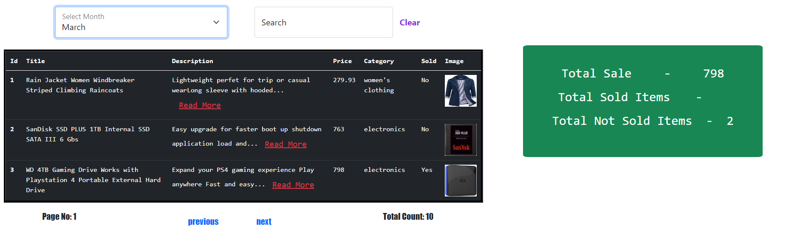

# Roxiler Project using MERN
live Link:-https://vercel.com/amitvis-projects/roxile-mern-coding
backen live link:-https://roxile-mern-coding.onrender.com/
## Installation
Install My Projects Using npm
```bash
    git clone https://github.com/amit-vis/roxile_MERN_coding.git
    npm install
    cd roxile_MERN_coding
```

## Running Test backend
To run tests, run the following command
```bash
    cd server
    npm start
```

## Running Test frontend
To run tests, run the following command
```bash
    cd client
    npm start
```

### Website look table



### chart
